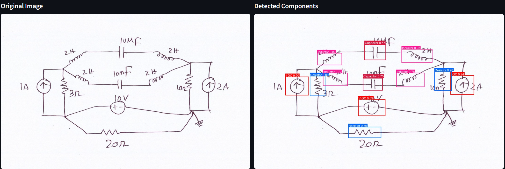
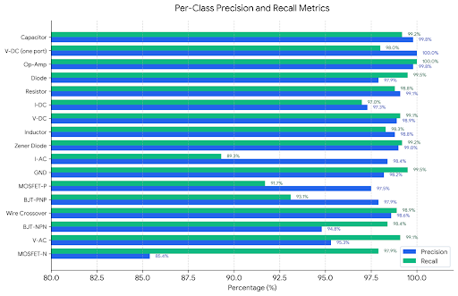

# Electronic Schematic Symbol Classifier

Developed an end-to-end computer vision pipeline using a supervised YOLOv8 Nano object detection model to detect and classify 17 foundational electronic components in hand-drawn schematics.

    
     
    <em>Fig. 1: Model classification example</em>

## Problem Statement <!--- do not change this line -->

Hand-drawn circuit schematics are standard for fast prototyping and engineering education, but converting paper sketches into digital circuits requires tedious, error-prone manual transcription before simulation or verification can occur. Automating this process bridges physical sketches and digital simulation workflows. However, real-world deployment faces challenges with varying sketching styles, class imbalance, and regional notation differences (such as American ANSI vs. European IEC standards) that can introduce errors into hardware designs if bias is not addressed.

## Key Results <!--- do not change this line -->

1. **High Detection Accuracy:** Achieved **98.8% mAP@50** and **76.1% mAP@50-95** across all 17 component classes on the Digitize-HCD validation set.
2. **Balanced Precision and Recall:** Reached **97.5% overall precision** and **97.5% overall recall**, with foundational components (resistors, capacitors, diodes) achieving near-perfect ~99% detection rates.
3. **Ultra-Fast Inference:** Attained a **~2.9 ms inference latency** per image on GPU using an exported ONNX format.
4. **Interactive Application:** Built and deployed a functional Streamlit user interface supporting custom image uploads, sample test schematics, and dynamic sensitivity/confidence threshold tuning.

    
     
    <em>Fig. 2: Key metrics per component class</em>

## Methodologies <!--- do not change this line -->

* **Model Training & Architecture:** Trained a lightweight, single-stage **YOLOv8 Nano** supervised object detection model with early stopping at **43 epochs** to prevent overfitting as validation loss plateaued.
* **Model Optimization & Export:** Exported trained weights into the **ONNX** runtime format for fast, client-side inference bundled directly into the web app.
* **Web UI & Deployment:** Built an interactive **Streamlit** dashboard configured via a Procfile for streamlined deployment and user testing.
* **Bias Mitigation & Responsible AI:**
  * Sourced diverse schematic drawings to mitigate handwriting style bias.
  * Applied data augmentation (rotation, stroke-width variation, and scaling) to generalize across sketching conventions.
  * Evaluated per-class precision and recall metrics to surface performance discrepancies across frequent vs. rare components.
  * Implemented balanced sampling to prevent common symbols (resistors, ground) from overshadowing complex, less frequent components..

## Data Sources <!--- do not change this line -->

* **Digitize-HCD Dataset:** A dataset of 1,277 total annotated hand-drawn circuit schematics across 17 symbol classes, evaluated with a 256-image validation subset.
  * *Citation:* N. Ahmed, M.F. Adnan, A. Shafiullah, H.J. Parash, Md.S. Rahman, I.C. Akib, G. Sarowar, "Digitize-HCD: A dataset for digitization of handwritten circuit diagrams," *Data in Brief*, vol. 59, p. 111315, Apr. 2025. [DOI: 10.1016/j.dib.2025.111315](https://doi.org/10.1016/j.dib.2025.111315)
* **Handwritten Logic Circuits Reference:** S. Amraee, M. Chinipardaz, M. Charoosaei and M. A. Mirzaei, "Handwritten Logic Circuits Analysis Using the YOLO Network and a New Boundary Tracking Algorithm," *IEEE Access*, vol. 10, pp. 76095-76104, 2022. [DOI: 10.1109/ACCESS.2022.3192467](https://doi.org/10.1109/ACCESS.2022.3192467)

## Technologies Used <!--- do not change this line -->

- Python
- YOLOv8 (Ultralytics)
- ONNX Runtime
- Streamlit
- Git & GitHub Pages

## Authors <!--- do not change this line -->

This project was completed in collaboration with:
- Jonathan Hahn
- Samantha Dominguez-Flores
- Dikshant Aryal
- Youssef Shaaban

[Access Streamlit Website](https://ai4all-electronic-schematics.streamlit.app/)